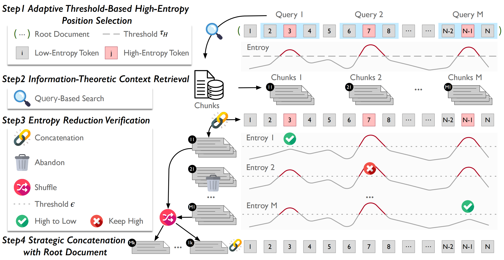

## EntropyLong: Uncertainty-Guided Long-Context Training for LLMs

This repository contains the code and scripts for our method **EntropyLong**, an uncertainty-guided long-context data construction approach for training large language models (LLMs).

## Quick Links

- [EntropyLong: Uncertainty-Guided Long-Context Training for LLMs](#entropylong-uncertainty-guided-long-context-training-for-llms)
- [Quick Links](#quick-links)
- [Overview](#overview)
- [EntropyLong Datasets](#entropylong-datasets)
- [Released Models](#released-models)
- [Training Long-Context Models](#training-long-context-models)
  - [Requirements](#requirements)
  - [Model Training](#model-training)
- [Evaluation](#evaluation)
  - [RULER Benchmark](#ruler-benchmark)
  - [LongBench-v2 after Instruction Tuning](#longbench-v2-after-instruction-tuning)
- [Bugs or Questions?](#bugs-or-questions)
- [Citation](#citation)

<a id="overview"></a>

## Overview

Training long-context language models to capture long-range dependencies requires specialized data construction. Current approaches, such as generic text concatenation or heuristic-based variants, frequently fail to guarantee genuine long-range dependencies. We propose \textbf{EntropyLong}, a novel data construction method that leverages predictive uncertainty to verify dependency quality. Our approach identifies high-entropy positions in documents, retrieves semantically relevant contexts from large corpora, and verifies their utility by assessing whether they reduce prediction entropy. This \textit{model-in-the-loop verification} ensures each dependency represents measurable information gain rather than spurious correlation. We construct training samples with long-range dependencies by combining original documents with these verified contextual supplements. Using FineWeb-Edu and Cosmopedia, we generate a dataset of 128K-length sequences with verified dependencies. Models trained on this data demonstrate significant improvements on RULER benchmarks, particularly in tasks requiring distant information. Following instruction fine-tuning, our models also achieve substantial gains on LongBench-v2, demonstrating enhanced long-context understanding. Extensive ablation studies further validate the necessity and effectiveness of entropy-based verification for long-context training.

<div style="text-align: center;">
  
</div>

<a id="entropylong-datasets"></a>

## EntropyLong Datasets

We release the EntropyLong training datasets used in our experiments. All datasets are available in the **EntropyLong Datasets** collection on Hugging Face:  
[EntropyLong Dataset Collection](https://huggingface.co/collections/caskcsg/entropylong-datasets).

Currently released datasets include:

| Dataset | Description |
|:--------|:-----------|
| [`caskcsg/entropylong_128k`](https://huggingface.co/datasets/caskcsg/entropylong_128k) | 128K-token sequences constructed with entropy-verified long-range dependencies, synthesized from FineWeb-Edu and Cosmopedia |

<a id="released-models"></a>

## Released Models

We release pre-trained and instruction-tuned models trained with EntropyLong data on Hugging Face under the account [`jiajunlong`](https://huggingface.co/jiajunlong):

| Model | Context Length | Description |
|:------|:--------------:|:------------|
| [`jiajunlong/EntropyLong_128K`](https://huggingface.co/jiajunlong/EntropyLong_128K) | 128K | Base long-context model pre-trained with EntropyLong 128K data |
| [`jiajunlong/EntropyLong_128K_SFT`](https://huggingface.co/jiajunlong/EntropyLong_128K_SFT) | 128K | Instruction-tuned (SFT) model built on top of EntropyLong pre-training, used for LongBench-v2 evaluation |

<a id="training-long-context-models"></a>

## Training Long-Context Models

<a id="requirements"></a>

### Requirements

We provide separate requirement files for training and evaluation:

```bash
# For training EntropyLong long-context models
pip install -r prolong/requirements_pip_train.txt

# For evaluation and analysis
pip install -r prolong/requirements_pip_eval.txt
```

Make sure you are using a recent version of PyTorch with CUDA support and GPUs with sufficient memory for 128K context training.


<a id="model-training"></a>

### Model Training

We provide shell scripts for training long-context models with EntropyLong data.

```bash
# Pre-train a 128K-context model with EntropyLong data
bash train_128k.sh

# (Optional) Instruction-tuned / SFT variant on 128K context
bash train_128k_sft.sh
```

These scripts assume that you have already prepared the EntropyLong training dataset and configured your distributed training environment (e.g., number of GPUs, batch size, and model checkpoints). 

<a id="evaluation"></a>

## Evaluation

We evaluate EntropyLong on both synthetic and real-world long-context benchmarks. In particular, we focus on:

- **RULER**: a comprehensive long-context benchmark covering needle-in-a-haystack, multi-step reasoning, variable tracking, and pattern extraction across multiple context lengths.
- **LongBench-v2** (after instruction tuning): a suite of realistic long-context tasks across diverse domains.

<a id="ruler-benchmark"></a>

### RULER Benchmark

EntropyLong achieves strong performance on the RULER benchmark:

| **RULER**   | **8k** | **16k** | **32k** | **64k** | **128k** | **Avg** |
|------------|:------:|:-------:|:-------:|:-------:|:--------:|:-------:|
| **EntropyLong** | **91.50** | **90.11** | **88.95** | **85.04** | **81.26** | **87.37** |

EntropyLong maintains robust accuracy across different context lengths, including 128K, indicating that the model has learned to effectively use distant information.

<a id="longbench-v2-after-instruction-tuning"></a>

### LongBench-v2 after Instruction Tuning

After instruction tuning (SFT) on top of EntropyLong pre-training, the gains generalize strongly to downstream long-context tasks in LongBench-v2:

| **Model**   | **Easy** | **Hard** | **Short** | **Medium** | **Long** | **Overall** |
|------------|:--------:|:--------:|:---------:|:----------:|:--------:|:-----------:|
| **EntropyLong** | **25.50** | **28.90** | **30.00** | **23.70** | **31.50** | **27.60** |

EntropyLong shows strong performance across all task categories, with particularly strong results on the **Long** category, demonstrating that uncertainty-guided, validated long-range dependencies translate into better real-world long-context reasoning.

<a id="bugs-or-questions"></a>

## Bugs or Questions?

If you have any questions related to the code or the method, feel free to email Junlong Jia (`jiajunlong@buaa.edu.cn`) or Xing Wu (`wuxing@iie.ac.cn`). If you encounter any problems when using the code, or want to report a bug, you can open an issue. Please try to specify the problem with sufficient details (environment, command, log, etc.) so we can help you better and faster.

## Citation

Please cite our paper if you use EntropyLong in your work:

```bibtex
@article{jia2025entropylong,
  title={EntropyLong: Effective Long-Context Training via Predictive Uncertainty},
  author={Jia, Junlong and Chen, Ziyang and Wu, Xing and Gao, Chaochen and Lin, Zijia and Zhang, Debing and Hu, Songlin and Guo, Binghui},
  journal={arXiv preprint arXiv:2510.02330},
  year={2025}
}
```
