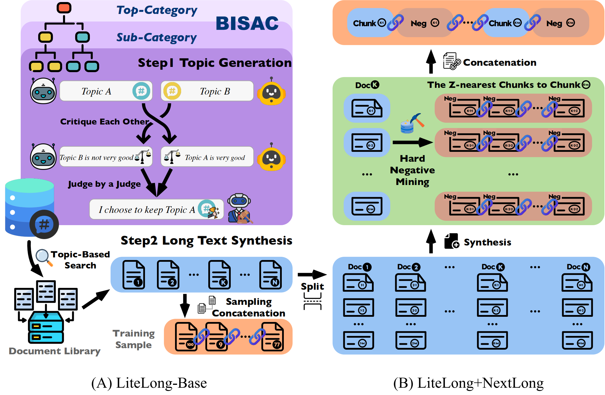

# LiteLong: Resource-Efficient Long-Context Data Synthesis for LLMs

This repository contains the code, models, and datasets for our paper [LiteLong: Resource-Efficient Long-Context Data Synthesis for LLMs](https://arxiv.org/pdf/2509.15568).

## Quick Links

- [LiteLong: Resource-Efficient Long-Context Data Synthesis for LLMs](#litelong-resource-efficient-long-context-data-synthesis-for-llms)
  - [Quick Links](#quick-links)
  - [Overview](#overview)
  - [LiteLong Datasets](#litelong-datasets)
  - [Released Models](#released-models)
  - [Training Long-Context Models](#training-long-context-models)
    - [Requirements](#requirements)
    - [Data Synthesis Pipeline](#data-synthesis-pipeline)
    - [Model Training](#model-training)
  - [Evaluation](#evaluation)
    - [Long-Context Performance](#long-context-performance)
    - [Short-Context Performance](#short-context-performance)
  - [Bugs or Questions?](#bugs-or-questions)
  - [Citation](#citation)

<a id="overview"></a>

## Overview

High-quality long-context data is essential for training large language models (LLMs) capable of processing extensive documents, yet existing synthesis approaches using relevance-based aggregation face challenges of computational efficiency. We present LiteLong, a resource-efficient method for synthesizing long-context data through structured topic organization and multi-agent debate. Our approach leverages the BISAC book classification system to provide a comprehensive hierarchical topic organization, and then employs a debate mechanism with multiple LLMs to generate diverse, high-quality topics within this structure. For each topic, we use lightweight BM25 retrieval to obtain relevant documents and concatenate them into 128K-token training samples. Experiments on HELMET and Ruler benchmarks demonstrate that LiteLong achieves competitive long-context performance and can seamlessly integrate with other long-dependency enhancement methods. LiteLong makes high-quality long-context data synthesis more accessible by reducing both computational and data engineering costs, facilitating further research in long-context language training.

<div style="text-align: center;">
  
</div>

<a id="litelong-datasets"></a>

## LiteLong Datasets

Our released datasets are listed as follows. All datasets are available at [LiteLong Dataset Collection](https://huggingface.co/collections/caskcsg/litelong-datasets-68cb862cec34f3fe662c9593).

|              Dataset              | Description |
|:-------------------------------|:--------:|
| [LiteLong_128k_dataset](https://huggingface.co/datasets/caskcsg/LiteLong_128k_dataset) | Dataset completely composed of 128K synthetic data |
| [Litelong_Nextlong_64k](https://huggingface.co/datasets/caskcsg/Litelong_Nextlong_64k) | LiteLong integrated with NExtLong for 64K data  |
| [Litelong_Nextlong_128k](https://huggingface.co/datasets/caskcsg/Litelong_Nextlong_128k) | LiteLong integrated with NExtLong for 128K data  |
| [Litelong_Nextlong_512k](https://huggingface.co/datasets/caskcsg/Litelong_Nextlong_512k) | LiteLong integrated with NExtLong for 512K data  |

All datasets are synthesized from short-text datasets [Fineweb-edu](https://huggingface.co/datasets/HuggingFaceFW/fineweb-edu) and [Cosmopedia v2](https://huggingface.co/datasets/HuggingFaceTB/smollm-corpus).

<a id="released-models"></a>

## Released Models

We provide pre-trained model weights for various configurations. All models are available on Hugging Face:

|              Model              | Context Length | Description |
|:-------------------------------|:--------:|:--------:|
| [jiajunlong/LiteLong_128K](https://huggingface.co/jiajunlong/LiteLong_128K) | 128K | LiteLong model trained on 128K context length |
| [jiajunlong/LiteLong_NExtLong_64K](https://huggingface.co/jiajunlong/LiteLong_NExtLong_64K) | 64K | LiteLong integrated with NExtLong for 64K context |
| [jiajunlong/LiteLong_NExtLong_128K](https://huggingface.co/jiajunlong/LiteLong_NExtLong_128K) | 128K | LiteLong integrated with NExtLong for 128K context |
| [jiajunlong/LiteLong_NExtLong_512K_SFT](https://huggingface.co/jiajunlong/LiteLong_NExtLong_512K_SFT) | 512K | LiteLong+NExtLong model with supervised fine-tuning for 512K context |

<a id="training-long-context-models"></a>

## Training Long-Context Models

<a id="requirements"></a>

### Requirements

Run the following script to install dependencies:

```bash
pip install -r requirements.txt
```

<a id="data-synthesis-pipeline"></a>

### Data Synthesis Pipeline

The complete data synthesis pipeline includes the following steps:

**Step 1: Generate Topics using Multi-Agent Debate**

Use the multi-agent debate mechanism to generate diverse, high-quality topics. This process involves:
- Two Debate LLMs independently generate topic candidates from BISAC categories
- The LLMs mutually critique each other's generated topics
- A Judge LLM adjudicates and selects the best topics

The specific prompts used in this process are detailed in **Appendix Section F** of our paper.

**Step 2: Build BM25 Index**

Build a BM25 index on the pre-training corpus using [Manticore Search](https://github.com/manticoresoftware/manticoresearch). Manticore Search provides efficient full-text search capabilities with BM25 ranking, enabling fast retrieval without requiring GPU resources.

**Step 3: Topic-based Retrieval and Document Concatenation**

For each generated topic, perform retrieval in the Manticore Search index to find relevant documents. Documents retrieved for the same topic are then concatenated to form long-context training samples (e.g., 128K tokens).

<a id="model-training"></a>

### Model Training

Use the generated data to train long-context models:

```bash
bash train_128K.sh
```

<a id="evaluation"></a>

## Evaluation

We evaluate LiteLong on both long-context and short-context benchmarks. For long-context evaluation, we use the [HELMET](https://github.com/princeton-nlp/HELMET) and [RULER](https://github.com/hsiehjackson/RULER) benchmarks.

### Long-Context Performance

The table below shows LiteLong's performance on long-context benchmarks (HELMET and RULER), including the variant combined with NExtLong for enhanced long-dependency modeling:

| **Method** | **Recall** | **RAG** | **ICL** | **Rerank** | **LongQA** | **RULER** | **AVG** |
|:-----------|:----------:|:-------:|:-------:|:----------:|:----------:|:---------:|:-------:|
| LiteLong | **83.23** | **60.43** | **80.12** | **30.73** | 33.01 | **83.88** | **61.90** |
| LiteLong+NExtLong | **82.93** | 60.81 | 80.12 | **33.68** | **36.97** | **83.73** | **63.04** |

**Key observations:**
- LiteLong achieves strong performance across all long-context metrics with minimal GPU cost (only 6 hours for generation)
- When combined with NExtLong, the method achieves the best average performance (63.04) while maintaining relatively low computational costs
- The embedding cost for LiteLong+NExtLong (170 hours) is significantly lower than baseline methods that require 928 GPU hours

### Short-Context Performance

To verify that long-context training does not degrade short-context capabilities, we evaluate on standard short-context benchmarks:

| **Model** | **ARC-c** | **ARC-e** | **HellaSwag** | **LogiQA** | **PIQA** | **WinoGrande** | **Avg** |
|:----------|:---------:|:---------:|:-------------:|:----------:|:--------:|:--------------:|:-------:|
| Llama3-8B-base | 50.34 | 80.18 | **60.13** | **27.50** | 79.60 | 72.85 | **62.05** |
| + LiteLong | **51.20** | **80.39** | 59.56 | **27.50** | **79.87** | **73.24** | 61.92 |

The results demonstrate that LiteLong maintains comparable performance to the base model across multiple short-context tasks, confirming that our long-context training approach does not compromise short-context capabilities.

<a id="bugs-or-questions"></a>

## Bugs or Questions?

If you have any questions related to the code or the paper, feel free to email Junlong Jia (`jiajunlong@buaa.edu.cn`) or Xing Wu (`wuxing@iie.ac.cn`). If you encounter any problems when using the code, or want to report a bug, you can open an issue. Please try to specify the problem with details so we can help you better and quicker!

<a id="citation"></a>

## Citation

Please cite our paper if you use LiteLong in your work:

```bibtex
@article{jia2025litelong,
  title={LiteLong: Resource-Efficient Long-Context Data Synthesis for LLMs},
  author={Jia, Junlong and Wu, Xing and Gao, Chaochen and Chen, Ziyang and Lin, Zijia and Li, Zhongzhi and Wang, Weinong and Xu, Haotian and Jin, Donghui and Zhang, Debing and others},
  journal={arXiv preprint arXiv:2509.15568},
  year={2025}
}
```
