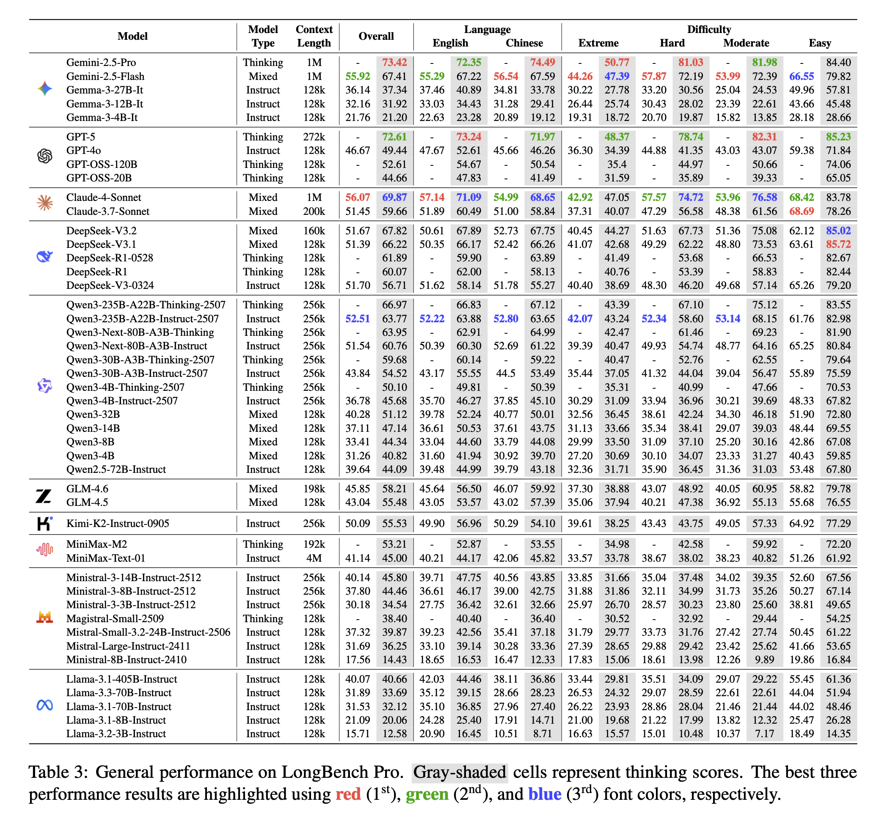
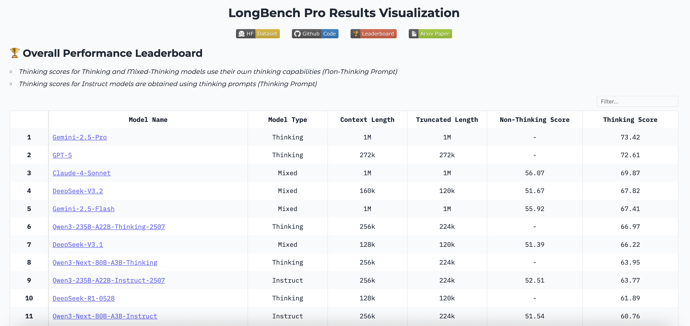
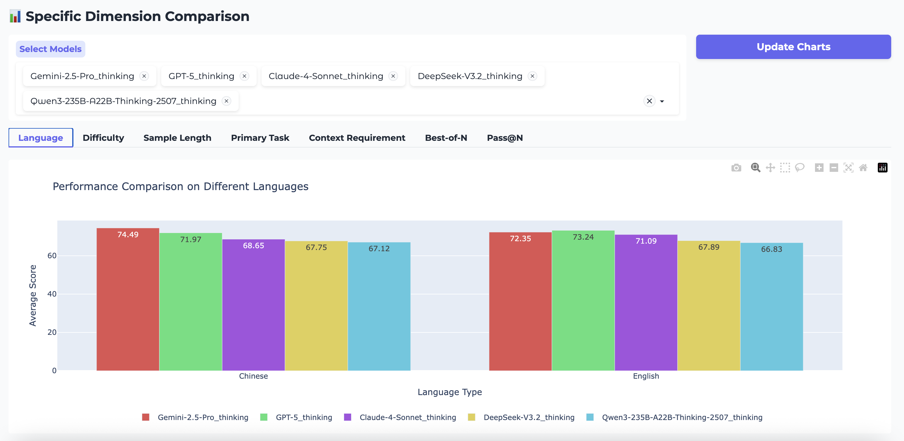

<div align="center">

<div align="center">
  
  <h1>LongBench Pro: A More Realistic and Comprehensive Bilingual Long-Context Evaluation Benchmark</h1>
</div>

[](https://huggingface.co/datasets/caskcsg/LongBench-Pro) &nbsp;&nbsp;
[](https://github.com/caskcsg/longcontext/tree/main/LongBench-Pro) &nbsp;&nbsp;
[]() &nbsp;&nbsp;
[](https://huggingface.co/spaces/caskcsg/LongBench-Pro-Leaderboard)


</div>

## 🔗 Quick Links

<div align="center">

[Overview](#overview) | [Dataset](#dataset) | [Inference Settings](#inference-settings) | [Main Results](#main-results) | [Evaluation](#evaluation)

</div>

## <a id="overview"></a>📖 Overview

Understanding and reasoning long contexts constitute a core capability of modern large language models. However, as model context lengths and long-context reasoning abilities improve rapidly, the development of long-context evaluation benchmarks increasingly lags behind. This lag arises from the trade-off between quality and cost. To address this challenge, we design a novel Human–Model Collaborative Sample Construction strategy that efficiently builds **LongBench Pro**, a more *realistic* and more *comprehensive* bilingual long-context benchmark containing 1,500 samples.

<div align="center">
  
</div>

## <a id="dataset"></a>📚 Dataset

LongBench Pro is available in the [HF Dataset](https://huggingface.co/datasets/caskcsg/LongBench-Pro), and the specific data details can be found in the [Arxiv paper]().

<div align="center">
  
</div>

## <a id="inference-settings"></a>⚙️ Inference Settings

All models are run **three times** using their **default parameters (with the temperature set to 1.0 when no default is provided)**. According to model characteristics, thinking models and mixed-thinking models use non-thinking prompts; the former reports thinking scores, while the latter reports scores with thinking mode enabled and disabled, respectively. Non-thinking (instruct) models report the corresponding scores based on the prompt type. For generation settings, **the output length is set to 1k for non-thinking scores and 8k for thinking scores (32k for models that support a 256k context length)**. When the input is excessively long, a middle-truncation strategy is applied.

## <a id="main-results"></a>📊 Main Results

<div align="center">
  
</div>

**We derive the following key insights (refer to our paper for a more detailed analysis):**

- *Training optimization outperforms mere size scaling.*
- *The claimed context length is decoupled from the effective context length.*
- *"Thinking" ability mitigates linguistic capability bias.*
- *Extreme tasks reveal substantial capability gaps.*
- *"Native thinking" serves as a key breakthrough.*
- *Mixed-thinking models achieve Pareto optimality.*

## <a id="evaluation"></a>🚀 Evaluation

### 1. Code, Dataset, and Model Downloads

Run the following command to download the evaluation code:

```bash
git clone https://github.com/caskcsg/longcontext.git
cd longcontext/LongBench-Pro
```

Run the following code to download the evaluation dataset:

```python
from huggingface_hub import snapshot_download

snapshot_download(
    "caskcsg/LongBench-Pro",
    repo_type="dataset",
    local_dir="./dataset",
    local_dir_use_symlinks=False
)
```

Run the following command to download the model for partial evaluation:

```bash
huggingface-cli download Qwen/Qwen3-Embedding-8B --local-dir ./model/Qwen3-Embedding-8B
```

**The directory structure is as follows:**

```
LongBench_Pro
├── dataset
│   └── longbench_pro.json
├── model
│   ├── Qwen3-Embedding-8B
│   └── Tokenizers
│       └── qwen
├── modules
│   ├── __init__.py
│   ├── data_loader.py
│   ├── evaluation.py
│   ├── inference.py
│   ├── model_manager.py
│   └── utils.py
├── output
│   └── model_info.json
├── app.py
├── main.py
├── README.md
└── requirements.txt
```

### 2. Requirements

Run the following script to install the dependencies:

```bash
python3 -m venv longbench_pro
source longbench_pro/bin/activate
pip install -r requirements.txt
```

### 3. Deployment of the model under evaluation

You need to deploy the model under evaluation so that it supports the **OpenAI-compatible API**. We recommend using [**vLLM**](https://github.com/vllm-project/vllm) or [**SGLang**](https://github.com/sgl-project/sglang).

### 4. Inference and Evaluation

All supported parameters can be found in `main.py`. Since inference may fail, we recommend performing inference and evaluation separately. We take the *thinking* evaluation of *Qwen3-235B-A22B-Instruct-2507* as an example, assuming that the model’s inference URL after deployment is `http://127.0.0.1:8000/v1`.

**Inference**

```python
python main.py \
    --model_name "Qwen3-235B-A22B-Instruct-2507" \
    --tokenizer_path "model/Tokenizers/qwen" \
    --context_max_length 224000 \
    --url "http://127.0.0.1:8000/v1" \
    --temperature 0.7 \
    --max_new_tokens 32768 \
    --bon_num 3 \
    --thinking_enabled \
    --only_infer
```

**Evaluation**

```python
python main.py \
    --model_name "Qwen3-235B-A22B-Instruct-2507" \
    --context_max_length 224000 \
    --bon_num 3 \
    --thinking_enabled \
    --only_eval
```

## 📈 Visualization

We also provide code to visualize the evaluation results you obtain on LongBench Pro. By simply running the code below, you can view the results at `http://localhost:7860`. This is consistent with the [LongBench Pro Leaderboard](https://huggingface.co/spaces/caskcsg/LongBench-Pro-Leaderboard).

```
python app.py
```

You will see content similar to the images below, which is consistent with the [LongBench Pro Leaderboard](https://huggingface.co/spaces/caskcsg/LongBench-Pro-Leaderboard).

<div align="center">
  
  
</div>

## 🐞 Bugs or Questions?

If you have any questions related to the code or the paper, feel free to email ZiYang (`chenziyang@iie.ac.cn`) and XingWu (`wuxing@iie.ac.cn`). If you encounter any problems when using the code, or want to report a bug, you can open an issue. Please try to specify the problem with details so we can help you better and quicker!

## 📝 Citation

Please cite our paper if you use LongBench-Pro in your work:

*Coming Soon...*
